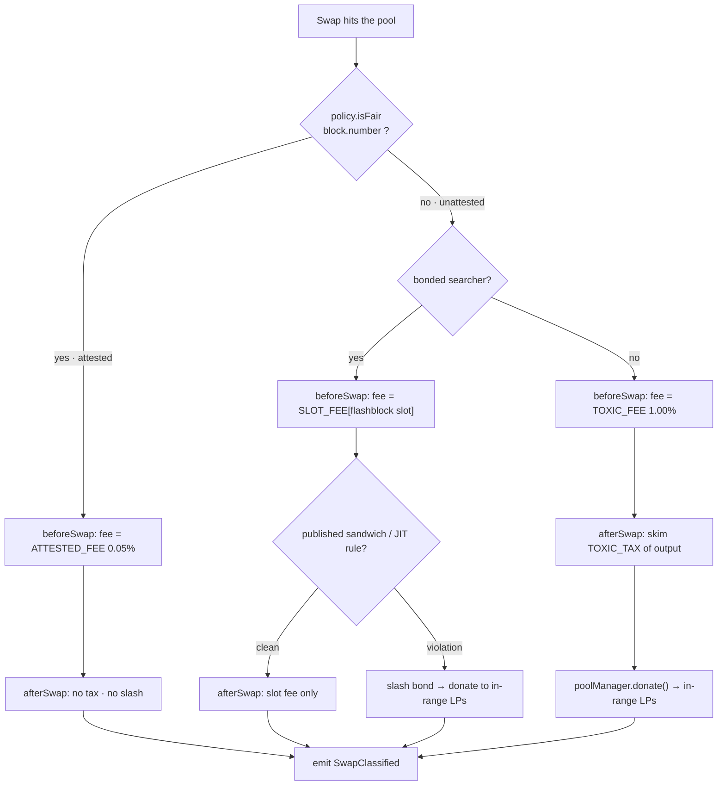
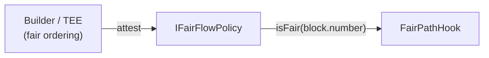
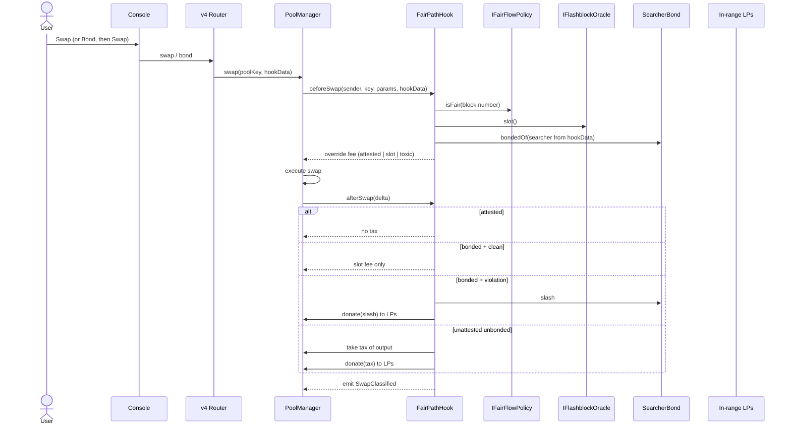
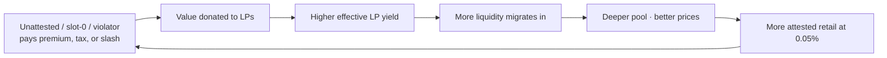

# Fair Path

[](./LICENSE)
[](https://docs.uniswap.org/contracts/v4/overview)

UHI10 capstone — *Sustainable Liquidity & MEV Protection*

> **Three corridors. One pool. Toxic flow pays. Honest flow is cheap.**

---

## The idea

**Fair Path is a Uniswap v4 hook that prices a swap by three facts the rest of the AMM pretends are identical:**

1. **Who built the block** — attested fair ordering (Flashbots Flashtestations / Unichain TEE) vs public mempool.
2. **Where in the block it sits** — Unichain Flashblocks (~200ms slots). Slot 0 is searcher first-look. Later slots are retail.
3. **Whether the searcher posted a bond** — priority is rented. A published sandwich / JIT rule slashes that bond into LPs.

Same pool, same liquidity, no dark pool, no FHE. Attested retail stays at a **low advertised fee**. Unattested searchers either **bond and pay a slot tax**, or they pay a **toxicity premium whose recapture is `donate`d to in-range LPs**. If they bond and then sandwich, the **bond is the insurance payout**.

This repo is the combined **1 + 2 + 5** design from the UHI10 idea board: Attested Fair Flow, Flashblocks Position Tax, and Searcher Bond Desk, as **one hook**.

## The problem it solves

Most "MEV protection" fails because it answers only one of three questions:

- **Attestation-only** (fair vs unfair block) cannot tell a searcher in slot 0 from a retail wallet that happened to land in an unattested block.
- **Delay / randomization** (18 prior UHI submissions) punishes everyone and still does not recapture LVR.
- **Dynamic fees on size / volatility** cannot tell good flow from bad — a toxic searcher and an honest whale look identical.
- **LVR auctions** (53 prior submissions) sell *first-in-block* as a global right. They do not price *this* pool's attested path, *this* flashblock slot, or *this* searcher's bond.

Fair Path closes the loop:

- Honest attested flow is **20× cheaper** than unattested public flow.
- First-look inside a block is a **priced slot**, not a free option.
- Searchers who want that slot **post capital**. A sandwich is not "MEV"; it is a **slashed insurance event** whose beneficiary is the LP.

## How it works

The hook drives three v4 primitives — **dynamic-fee override**, **`afterSwapReturnDelta` recapture**, and **`donate`** — plus a bond ledger sitting next to the pool:

1. **`beforeSwap`** reads three oracles / ledgers and returns an override fee.
2. **`afterSwap`** recaptures a toxicity tax on the unattested, unbonded path and donates it to in-range LPs.
3. **`afterSwap`** (same callback) evaluates the published sandwich / JIT rule against bonded searchers and slashes into the same donate sink.
4. **`afterInitialize`** enforces the dynamic-fee flag so the override is always valid.



## Corridor 1 — attestation (who built the block)

The hook **never inspects a block**. It uses `block.number` as a lookup key and delegates fairness to an external oracle:

```solidity
// FairPathHook — corridor 1
bool fair = policy.isFair(block.number);
```

The oracle is bound at construction as an `immutable IFairFlowPolicy policy`:



| | This repo | Live Unichain |
|---|---|---|
| Oracle | `UnichainFairOracle` | Same contract, `FLASHBLOCK_NUMBER` + `BLOCK_BUILDER_POLICY` env |
| How a block becomes "fair" | Owner-set TEE / builder keys call `incrementFlashblock`, or the live feed is non-zero | Unichain TEE builders increment `FlashblockNumber` |
| Why | Permissionless `openFairWindow` is not production | Only genuine attested sequencing gets the retail lane |

**Honest boundary.** Pricing and recapture are the hook's job. Proving fairness is the oracle's job. A production oracle must make block *N*'s attestation readable **during** block *N* — exactly what in-block Flashtestations / builder policy provide, as opposed to an after-the-fact report.

## Corridor 2 — flashblock slot (where in the block)

Unichain Flashblocks split a block into ~200ms sub-blocks. Slot 0 is the searcher's first-look. Later slots are where retail actually lands. Fair Path **taxes the slot, not the wallet**.

```solidity
// FairPathHook — corridor 2
uint8 slot = flashblocks.slot(); // 0 = first-look, higher = later
uint24 fee = SLOT_FEE[slot];
```

| Slot | Who it is for | Fee (unattested + bonded) | Recapture |
|---|---|---|---|
| 0 | Searcher first-look | Highest slot fee | Slot premium is LP yield |
| 1–2 | Mid-block | Mid | Same |
| 3–4 | Late / retail-like | Lowest slot fee | Approaches attested retail |

On chains without a live feed, only addresses in `builders[]` (owner-seeded from FlashtestationRegistry / TEE keys) may increment. There is no permissionless window.

This is not a delay hook. Nothing waits. The swap executes now. The **price of now** depends on *when* inside the block it is.

## Corridor 3 — searcher bond (who is allowed first-look)

Priority is rented. A searcher calls `bond(amount)` in **fpVOL** (`SearcherBond.asset()`, also token0 of this pool). While `bondedOf(searcher) >= minBond`:

- they may take the **bonded slot-fee path** instead of the toxic 1.00% path
- they are subject to a **published, on-chain rule**

**Published rule (v1, deliberately narrow — do not claim omniscience):**

| Violation | Detection window | Effect |
|---|---|---|
| Same-block opposite-direction swap from the bonded address | This block | Slash `SLASH_BIPS` of the bond |

Slashed principal is `donate`d to in-range LPs of **this** pool (fpVOL/fpUSD). Retail never bonds. Identity is passed as a searcher address in `hookData` (the v4 `sender` is the router, never the end user — see below).

```solidity
interface ISearcherBond {
    function bond(uint256 amount) external;
    function unbond(uint256 amount) external; // subject to unbonding delay
    function bondedOf(address searcher) external view returns (uint256);
}
```

## Complete user flow



## Hook functions implemented

| Function | Permission | What it does |
|---|---|---|
| `getHookPermissions` | — | Enables `afterInitialize`, `beforeSwap`, `afterSwap`, `afterSwapReturnDelta`. |
| `_afterInitialize` | `afterInitialize` | Reverts unless the pool uses the **dynamic-fee flag**. |
| `_beforeSwap` | `beforeSwap` | Reads fairness, flashblock slot, and bond; returns override fee with `OVERRIDE_FEE_FLAG`. |
| `_afterSwap` | `afterSwap` + return delta | Recaptures toxic tax and/or slashes a violating bond; `take` → `donate` → `settle`; emits `SwapClassified`. |
| `bond` / `unbond` | — | Searcher capital in; delayed capital out. |

**On-chain parameters & state**

| Name | Value / type | Meaning |
|---|---|---|
| `ATTESTED_FEE` | `500` (0.05%) | Retail fee for attested-fair blocks |
| `TOXIC_FEE` | `10_000` (1.00%) | Premium fee for unattested, unbonded flow |
| `TOXIC_TAX_BIPS` | `50` (0.50%) | Cut of the output leg donated to LPs on the toxic path |
| `SLOT_FEE[0..4]` | increasing → decreasing | Unattested bonded fee by flashblock slot |
| `MIN_BOND` | `uint256` | Minimum fpVOL to take the bonded corridor |
| `SLASH_BIPS` | `uint256` | Fraction of bond donated on a published-rule hit |
| `UNBOND_DELAY` | `uint256` | Blocks before `unbond` completes (stops hit-and-run) |
| `totalTaxDonated[poolId]` | `uint256` | Cumulative recapture + slashes for LPs |
| `lastSwap[poolId]` | `struct` | Last classification (corridor, fee, tax, slot, searcher, block) |
| `SwapClassified` | `event` | Per-swap source of truth for the analytics tape |
| `BondSlashed` | `event` | Searcher, amount, victim swap, rule id |

**Oracle seams**

```solidity
interface IFairFlowPolicy {
    function isFair(uint256 blockNumber) external view returns (bool);
    function fairUntilBlock() external view returns (uint256);
}

interface IFlashblockOracle {
    function slot() external view returns (uint8); // 0..MAX_SLOT
}
```

Production oracle: `UnichainFairOracle` wrapping Unichain `FlashblockNumber` / `BlockBuilderPolicy`, or a local feed gated by `setBuilder`.

## Why `sender` is not the searcher

v4 `beforeSwap`'s `sender` is the **router**, not the wallet. Fair Path therefore:

- treats empty `hookData` as the router (retail / untagged flow)
- keys bonds on `abi.encode(searcher)` when a bonded agent opts in
- never uses `tx.origin`

The hook never uses `msg.sender` as user identity. `msg.sender` is the PoolManager.

## Integrations

| Layer | Integration | Used for |
|---|---|---|
| **Uniswap v4 core** | `PoolManager`, dynamic-fee override, `donate`, `BalanceDelta`, `CurrencySettler` | Fee control + LP recapture |
| **OpenZeppelin** | `uniswap-hooks` `BaseHook` | Safe hook base + permission wiring |
| **Flashbots / Unichain** | Flashtestations / `BlockBuilderPolicy` | Attestation source behind `IFairFlowPolicy` |
| **Unichain** | Flashblocks | Slot oracle behind `IFlashblockOracle` |
| **Frontend / SDK** | `@uniswap/v4-sdk`, `viem`, React | Dual-corridor quoting, slot slider, bond desk, live tape |

**Partner integrations (hookathon README requirement)**

- Flashbots Flashtestations — `IFairFlowPolicy` via `UnichainFairOracle` (live feed or owner-gated builders).
- Unichain Flashblocks — `IFlashblockOracle.slot()` is `flashblockNumber % 5`.

No other partners are claimed.

## Why it's profitable — as an idea and a business

Fair Path is not a fee grab. It is a **flywheel** that makes one pool the best venue for LPs *and* honest traders.



**For LPs — sustainable yield.** Recapture and slashes come from the *exact* flow that used to bleed them. Risk-adjusted LP returns rise; liquidity sticks on volatile pairs.

**For honest traders — a cheap attested lane.** 0.05% vs 1.00%. Traders are paid, in fee terms, to route through Protect / attested builders.

**For searchers — a legal product.** Bond, take slot 0, pay the slot fee, keep clean arb. Sandwiching is not "strategy"; it is a deductible.

**For the protocol — a MEV-derived fee line.** Today 100% of tax + slash goes to LPs. A later protocol split (e.g. 80/20) taxes **searchers**, never attested retail.

**Why it fits UHI10.** The theme is *Sustainable Liquidity & MEV Protection*. Fair Path hits both: LPs earn from the flow that harms them, and toxic order flow is **repriced and bonded** instead of blindly served. It also hits the published win condition: **defense + recapture in one hook**, plus a partner (Flashbots) that does not appear in any of the 660 prior directory rows.

## What this is not

- Not an FHE dark pool (61 prior FHE submissions; UHI10 slide 7 calls them over-built).
- Not a generic LVR first-in-block auction (53 prior).
- Not a randomized delay (AsyncSwapHook and ~18 cousins).
- Not three hooks glued in a README. One `FairPathHook`, one fee override, one donate sink.

## The console

Live: **https://uhi10-fair-path.vercel.app**

Uniswap v4 SDK quotes against live pool state. Pages: Desk, Trade, Book, Tape, Builders, Notes. Pool is **fpVOL / fpUSD** (this hook’s mocks only).

`forge test` covers toxic tax, attested heartbeat, unauthorized increment, bonded slot fee, same-block slash, static-fee init revert, bad hookData, unbond delay.

## Repository layout

```
src/
  FairPathHook.sol
  SearcherBond.sol
  UnichainFairOracle.sol
  interfaces/
test/
  FairPathHook.t.sol
script/
  DeployUnichain.s.sol
  PopulateTraffic.s.sol
frontend/
```

## Hookathon gates

- Public repo (this repository)
- Valid Uniswap v4 hook
- Functioning frontend: https://uhi10-fair-path.vercel.app
- README partner integrations: Flashbots Flashtestations, Unichain Flashblocks
- Video: attested vs slot-0 bonded vs toxic vs slash, no AI voice
- Original work for UHI10; not a resubmission of the Fair Flow (attestation-only) capstone
