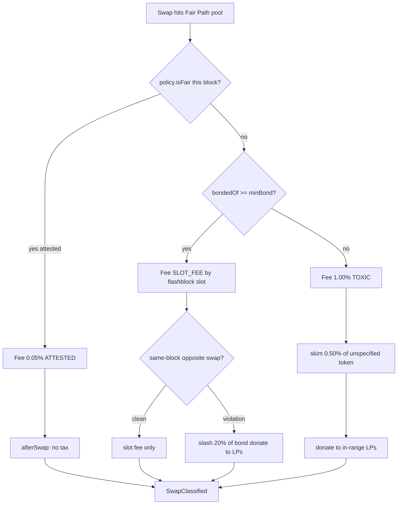
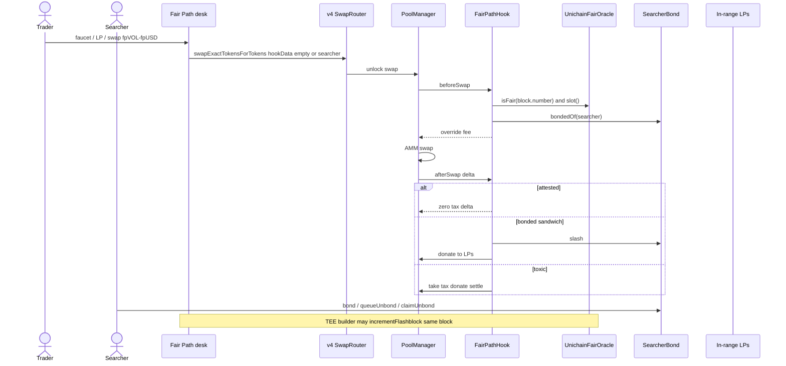
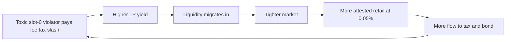

# Fair Path

[](./LICENSE)
[](https://docs.uniswap.org/contracts/v4/overview)
[](https://sepolia.uniscan.xyz)

**Live desk:** [uhi10-fair-path.vercel.app](https://uhi10-fair-path.vercel.app) · **Pitch:** [uhi10-fair-path-pitch.vercel.app](https://uhi10-fair-path-pitch.vercel.app) · **Pool:** fpVOL / fpUSD · **Hook:** [`0xcC3E3A4811a8eA4e529c4949EC7a18A319c310c4`](https://sepolia.uniscan.xyz/address/0xcC3E3A4811a8eA4e529c4949EC7a18A319c310c4)

> Three corridors. One pool. Toxic flow pays LPs. Honest flow is cheap.

---

## The idea

Fair Path is a **Uniswap v4 hook that prices every swap by three facts AMMs usually treat as identical**: who built the block, where in the block the swap sits, and whether the searcher posted a bond.

It is one pool with three corridors:

1. **Attested / TEE-sequenced** — Flashtestations or Unichain TEE builders. Retail fee **0.05%**, no recapture tax.
2. **Unattested + bonded** — searcher rented first-look. Fee follows the **flashblock slot** (slot 0 is expensive; later slots approach retail).
3. **Unattested + unbonded** — public toxic flow. Fee **1.00%** plus a **0.50% output skim** `donate`d to in-range LPs.

If a bonded searcher sandwiches (same-block opposite-direction swap), **20% of the bond is slashed into the same LP sink**.

Same liquidity. No dark pool. No delay. The *price of now* depends on fairness, slot, and capital at risk.

---

## The problem it solves

Vanilla AMMs give searchers a free option on LPs. “MEV protection” usually answers only one question:

| Approach | What it misses |
|---|---|
| Attestation-only | Cannot tell a slot-0 searcher from retail that landed in an unattested block |
| Delay / encryption | Punishes everyone; LVR still leaks |
| Size / vol dynamic fees | A toxic searcher and an honest whale look the same |
| Top-of-block LVR auctions | Sell *who goes first globally*, not *this pool’s* attested path, slot, or bond |

Fair Path closes the loop: **honest attested flow is ~20× cheaper than unattested public flow**, first-look is a **priced slot**, and sandwiches are an **insurance event whose beneficiary is the LP**.

---

## How it works

The hook uses three v4 primitives — **dynamic-fee override**, **`afterSwapReturnDelta`**, and **`donate`** — plus a `SearcherBond` ledger next to the pool.

1. **`beforeSwap`** reads `policy.isFair(block.number)`, `flashblocks.slot()`, and `bonds.bondedOf(searcher)` (searcher from 32-byte `hookData`; empty `hookData` is untagged / router).
2. It returns an override fee with `OVERRIDE_FEE_FLAG`.
3. **`afterSwap`** recaptures toxic tax and/or slashes a violating bond, then `take` → `donate` → `settle` so in-range LPs receive the capital.
4. **`afterInitialize`** requires the dynamic-fee flag so the override is always legal.

v4 `sender` is the **router**, not the wallet. Bonds key off `abi.encode(searcher)` in `hookData`. The hook never uses `tx.origin` or `msg.sender` as the user (`msg.sender` is PoolManager).



| Corridor | Fee | Recapture |
|---|---|---|
| Attested | 0.05% (`500`) | none |
| Bonded slot 0–4 | 0.80% / 0.50% / 0.30% / 0.15% / 0.075% | slash on published sandwich rule |
| Toxic | 1.00% (`10_000`) | `TOXIC_TAX_BIPS = 50` of output |

Published slash rule (v1, narrow on purpose): **same-block opposite-direction swap from the bonded searcher** → `SLASH_BIPS = 2000` of `bondedOf`. Unbond is delayed so the sandwich cannot exit in the same block.

---

## Complete user flow



**Desk surfaces:** Trade, LP, builders (TEE pulse), bond, tape (`SwapClassified` / `BondSlashed`).

---

## Hook functions implemented

| Surface | Permission | Behavior |
|---|---|---|
| `getHookPermissions` | — | `afterInitialize`, `beforeSwap`, `afterSwap`, `afterSwapReturnDelta` |
| `_afterInitialize` | `afterInitialize` | revert `NotDynamicFee` unless `DYNAMIC_FEE_FLAG` |
| `_beforeSwap` | `beforeSwap` | classify corridor; return fee \| `OVERRIDE_FEE_FLAG` |
| `_afterSwap` | `afterSwap` + return delta | toxic recapture and/or slash; emit `SwapClassified` |
| `slotFee(uint8)` | view | public slot schedule |
| `SearcherBond.bond` | — | post fpUSD (bond asset = token1) |
| `SearcherBond.queueUnbond` / `claimUnbond` | — | delayed exit |
| `SearcherBond.slash` | hook only | pay LPs via hook donate |
| `UnichainFairOracle.incrementFlashblock` | builder / TEE policy | local fairness heartbeat |
| `UnichainFairOracle.setBuilder` | owner | enroll Flashtestation / TEE keys |
| `DeskRunner` | agent | same-block attested / toxic / bonded bursts |

---

## Deployments — Unichain Sepolia (chainId 1301)

Hooks are **fixed**. Shared Uniswap v4 periphery is the Unichain Sepolia canonical set.

| Contract | Address |
|---|---|
| **FairPathHook** | [`0xcC3E3A4811a8eA4e529c4949EC7a18A319c310c4`](https://sepolia.uniscan.xyz/address/0xcC3E3A4811a8eA4e529c4949EC7a18A319c310c4) |
| **UnichainFairOracle** (policy + slots) | [`0x023E26027269f7b86Db07af08f640217FbD6E8Fa`](https://sepolia.uniscan.xyz/address/0x023E26027269f7b86Db07af08f640217FbD6E8Fa) |
| **SearcherBond** | [`0xa0bbbffc04B7cFaD6CfC6Bb78245c1D49Ae5CF77`](https://sepolia.uniscan.xyz/address/0xa0bbbffc04B7cFaD6CfC6Bb78245c1D49Ae5CF77) |
| **DeskRunner** (agent) | [`0xca2985A449C528c702c7a10e9f947234381ABA0E`](https://sepolia.uniscan.xyz/address/0xca2985A449C528c702c7a10e9f947234381ABA0E) |
| fpVOL (token0) | [`0x465F7D399884D0b8c3b1af358036B50333Ac2f31`](https://sepolia.uniscan.xyz/address/0x465F7D399884D0b8c3b1af358036B50333Ac2f31) |
| fpUSD (token1, bond asset) | [`0x67CD45F3d37be29e6151a9AC5a053cB8Cb671803`](https://sepolia.uniscan.xyz/address/0x67CD45F3d37be29e6151a9AC5a053cB8Cb671803) |
| PoolManager | [`0x00B036B58a818B1BC34d502D3fE730Db729e62AC`](https://sepolia.uniscan.xyz/address/0x00B036B58a818B1BC34d502D3fE730Db729e62AC) |
| SwapRouter | [`0x9cD2b0a732dd5e023a5539921e0FD1c30E198Dba`](https://sepolia.uniscan.xyz/address/0x9cD2b0a732dd5e023a5539921e0FD1c30E198Dba) |
| PositionManager | [`0xf969Aee60879C54bAAed9F3eD26147Db216Fd664`](https://sepolia.uniscan.xyz/address/0xf969Aee60879C54bAAed9F3eD26147Db216Fd664) |
| Permit2 | [`0x000000000022D473030F116dDEE9F6B43aC78BA3`](https://sepolia.uniscan.xyz/address/0x000000000022D473030F116dDEE9F6B43aC78BA3) |
| StateView | [`0xa7aE8a3974822496506E820C0B279f7C73A0e00e`](https://sepolia.uniscan.xyz/address/0xa7aE8a3974822496506E820C0B279f7C73A0e00e) |

Pool fee flag: `8388608` (dynamic). Tick spacing: `60`. Deploy block: `61520858`. Addresses also live in `frontend/src/deployed.json`.

---

## Integrations

| Partner / layer | How Fair Path uses it |
|---|---|
| **Uniswap v4** | `PoolManager` callbacks, dynamic fees, `donate`, `CurrencySettler` |
| **OpenZeppelin uniswap-hooks** | `BaseHook` permissions |
| **Flashbots Flashtestations** | `IFairFlowPolicy` via `UnichainFairOracle` (live feed or owner-gated builders) |
| **Unichain Flashblocks** | `IFlashblockOracle.slot()` = flashblock number mod 5 |
| **Permit2 + POSM** | LP mint from the desk |
| **viem + Uniswap v4 SDK** | quotes, swaps, live tape |

No other partners are claimed.

---

## Why this is a business

Fair Path is a **venue**, not a token gimmick. The customer who pays is toxic / first-look flow. The customer who stays is the LP. The product you sell to searchers is **licensed priority**.



**Unit economics (v1)**

- **LP take:** 100% of toxic skim + slashes. That is the wedge vs vanilla v4 (where LVR leaves the pool).
- **Searcher take:** exclusivity of a bonded slot vs racing the public mempool; they keep clean arb after the slot fee.
- **Retail take:** 0.05% attested lane vs 1.00% public — wallets and Protect-style RPCs have a reason to point *here*.
- **Protocol take (later):** a split on *searcher* tax/slash (e.g. 80/20 LP/protocol), **never** on attested retail. That is a MEV-native SaaS line: you tax the option AMMs currently give away.

**Go-to-market:** volatile pairs (the LVR is largest), then wallets/builders that already attest, then a bond desk for solvers. The flywheel is liquidity: once LPs earn recapture, depth improves, retail follows, searchers must bond to stay in slot 0.

**UHI10 fit:** sustainable liquidity (LPs paid by the flow that harmed them) + MEV protection (repriced + bonded toxic order flow) in **one hook**.

---

## What this is not

Not an FHE dark pool, not a generic TOB LVR auction, not a randomized delay, not three hooks glued in a README.

## Tests and layout

`forge test` — units, differentiation, invariants, Unichain fork, DeskRunner.

```
src/FairPathHook.sol  src/SearcherBond.sol  src/UnichainFairOracle.sol  src/DeskRunner.sol
test/  script/  frontend/  pitch/
```

## Hookathon gates

Public repo · valid v4 hook · live UI · partners Flashbots + Unichain Flashblocks · original UHI10 work (not Fair Flow resubmitted).
